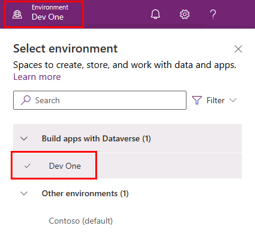
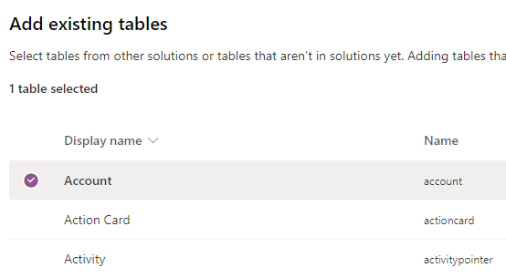

---
lab:
  title: 'Lab 1: Herausgeber und Lösung'
  module: 'Module 1: Create tables in Dataverse'
---

# Übungseinheit 1 – Herausgeber und Lösung

## Szenario

In dieser Übung erstellen Sie einen Herausgeber und eine Lösung.

## Lernziele

- Erstellen einer Lösung in Microsoft Dataverse
- So fügen Sie einer Lösung vorhandene Komponenten hinzu

## Weiterführende Schritte des Lab

- Einen Herausgeber erstellen
- Erstellen einer -Lösung
- Hinzufügen von Tabellen, Spalten, Ansichten und Formularen zur Lösung
  
## Voraussetzungen

- Sie müssen Folgendes abgeschlossen haben: **Lab 0: Überprüfen der Labumgebung**

## Ausführliche Schritte

## Übung 1 – Erstellen von Herausgeber und Lösung

In dieser Übung greifen Sie auf das Power Apps Maker-Portal, die Entwicklerumgebung, zu und erstellen eine neue Lösung.

### Aufgabe 1.1 – Maker-Portal

1. Navigieren Sie auf einer neuen Registerkarte zum Power Apps Maker-Portal `https://make.powerapps.com` und melden Sie sich bei erneuter Aufforderung mit Ihren Microsoft 365-Anmeldeinformationen an.

1. Wenn Sie aufgefordert werden, eine **Telefonnummer einzugeben**, geben Sie `0123456789` ein, und wählen Sie **Absenden** aus.

1. Wechseln Sie Umgebungen mithilfe der Umgebungsauswahl in der oberen rechten Ecke des Bildschirms.

1. Wählen Sie in der Liste die **Dev One**-Umgebung aus.

    

1. Wählen Sie im linken Navigationsbereich **Apps** und dann **Alle** aus. Es sollten mehrere Apps angezeigt werden, darunter Dataverse Accelerator-App, Solution Health Hub und Power Pages Management.

1. Wählen Sie **Tabellen** im linken Navigationsbereich aus. Die Standardtabellen aus dem *Common Data Model*, einschließlich Konto und Kontakt, sollten angezeigt werden.

### Aufgabe 1.2 – Erstellen einer Lösung und eines Herausgebers

1. Wählen Sie **Lösungen** im linken Navigationsbereich aus. Es sollten mehrere Lösungen wie die *Standardlösung* und die *Standardlösung für allgemeine Datendienste* angezeigt werden.

    

1. Wählen Sie **+ Neue Lösung** aus.

1. Geben Sie im Textfeld **Anzeigename** **`Property listings`** ein.

1. Stellen Sie sicher, dass der **Name** automatisch ausgefüllt wird.

1. Wählen Sie **+ Neuer Herausgeber** unterhalb der **Publisher-Dropdownliste** aus.

1. Geben Sie für **Anzeigename** `Contoso Real Estate` ein.

1. Geben Sie für **Name** `contosorealestate` ein.

1. Geben Sie für **Präfix** `cre` ein.

    

1. Wählen Sie **Speichern**.

1. Wählen Sie in der Dropdownliste **Publisher** **Contoso Real Estate (contosorealestate)** aus.

1. Klicken Sie auf **Erstellen**.

    

## Übung 2 – Hinzufügen von Komponenten zur Lösung

In dieser Übung fügen Sie der Lösung eine vorhandene Tabelle hinzu.

### Aufgabe 2.1 – Tabelle hinzufügen

1. Navigieren Sie zum Power Apps Maker-Portal `https://make.powerapps.com`

1. Stellen Sie sicher, dass Sie sich in der Umgebung **Dev One** befinden.

1. Wählen Sie **Lösungen** aus.

1. Wählen Sie die Lösung **Immobilienanzeigen** aus der vorherigen Übung aus.

    

1. Wählen Sie **Vorhandene hinzufügen** und **Tabelle** aus.

    

1. Wählen Sie die Tabelle **Konto** aus.

    

1. Wählen Sie **Weiter** aus.

1. Wählen Sie unter der Tabelle **Konto** den Link **Objekte auswählen** aus.

1. Wählen Sie auf der Registerkarte **Spalten** die Spalte **Kontonummer** aus.

1. Klicken Sie auf die Registerkarte **Ansichten**.

1. Wählen Sie die Ansicht **Aktive Konten** aus.

1. Wählen Sie die Registerkarte **Formulare** aus.

1. Wählen Sie das Formular **Konto** aus.

1. Wählen Sie **Hinzufügen** aus.

    > **Hinweis:** Sie sollten 1 Ansicht, 1 Formular und 1 Spalte für die Tabelle **Konto** ausgewählt haben.

    

1. Wählen Sie **Hinzufügen** aus.
