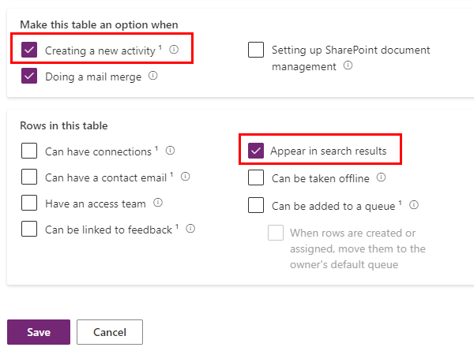
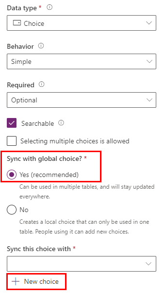

---
lab:
  title: "Lab\_2: Datenmodell"
  module: 'Module 1: Create tables in Dataverse'
---

# Übungslab 2 – Datenmodell

## Szenario

In diesem Lab erstellen Sie Dataverse-Tabellen, -Spalten und -Beziehungen.

Contoso Real Estate möchte zwei Schlüsselziele verfolgen:

- Immobilienanzeigen
- Wer ist für die Besichtigung von Immobilien eingeplant?

## Lernziele

- So erstellen Sie Tabellen in Dataverse
- So fügen Sie Spalten zu Dataverse-Tabellen hinzu
- So erstellen Sie Beziehungen zwischen Tabellen

## Weiterführende Schritte des Lab

- Erstellen von Tabellen
- Spalten erstellen
- Erstellen von Beziehungen
  
## Voraussetzungen

- Sie müssen **Lab 1: Herausgeber und Lösung** abgeschlossen haben

## Ausführliche Schritte

## Übung 1 – Erstellen von Tabellen

In dieser Übung erstellen Sie Tabellen und fügen sie der Lösung hinzu.

### Aufgabe 1.1 – Tabelle „Real Estate Property“ erstellen

1. Navigieren Sie zum Power Apps Maker-Portal `https://make.powerapps.com`

1. Stellen Sie sicher, dass Sie sich in der Umgebung **Dev One** befinden.

1. Wählen Sie **Lösungen** aus.

1. Öffnen Sie die Lösung **Immobilienanzeigen**.

1. Wählen Sie **+ Neu**, dann **Tabelle** und **Tabelle (erweiterte Eigenschaften)** aus.

    

1. Geben Sie für **Anzeigename** `Real Estate Property` ein. Der Pluralname wird automatisch ausgefüllt.

1. Wählen Sie die Registerkarte **Primärspalte** aus.

1. Geben Sie für **Anzeigename** `Property Name` ein.

1. Erweitern Sie **Erweiterte Optionen**, überprüfen Sie die verfügbaren Optionen, ändern Sie hier jedoch nichts.

    

1. Klicken Sie auf die Registerkarte **Eigenschaften**.

1. Erweitern Sie **Erweiterte Optionen**.

1. Aktivieren Sie das Kontrollkästchen **Erstellen einer neuen Aktivität**.

1. Aktivieren Sie das Kontrollkästchen **In Suchergebnissen anzeigen**.

    

1. Wählen Sie **Speichern**.

1. Wählen Sie **Eigenschaften** aus.

    

1. Aktivieren Sie das Kontrollkästchen **Anlagen aktivieren**, und wählen Sie **Speichern** aus.

### Aufgabe 1.2 – Tabelle „Showing“ erstellen

1. Wählen Sie im Bereich **Objekte** die Option **Alle**aus.

1. Wählen Sie **+ Neu**, dann **Tabelle** und **Tabelle (erweiterte Eigenschaften)** aus.

1. Geben Sie für **Anzeigename** `Showing` ein. Der Pluralname wird automatisch ausgefüllt.

1. Erweitern Sie **Erweiterte Optionen**.

1. Aktivieren Sie das Kontrollkästchen **In Suchergebnissen anzeigen**.

1. Wählen Sie **Speichern**.

### Aufgabe 1.3 – Tabelle „Open House“ erstellen

1. Wählen Sie im Bereich **Objekte** die Option **Alle**aus.

1. Wählen Sie erneut **+ Neu**, dann **Tabelle** und **Tabelle (erweiterte Eigenschaften)** aus.

1. Geben Sie für **Anzeigename** `Open House` ein. Der Pluralname wird automatisch ausgefüllt.

1. Erweitern Sie **Erweiterte Optionen**.

1. Wählen Sie **Organisation** für **Datensatzbesitz** aus.

1. Wählen Sie **Speichern**.

### Aufgabe 1.4 – Tabelle „Contact“ hinzufügen

1. Wählen Sie im Bereich **Objekte** die Option **Alle**aus.

1. Wählen Sie zunächst **Vorhandene hinzufügen** und dann **Tabelle** aus.

1. Wählen Sie die Tabelle **Kontakt**.

1. Wählen Sie **Weiter** aus.

1. Wählen Sie **Hinzufügen** aus.

## Übung 2 – Spalten erstellen

In dieser Übung erstellen Sie Spalten für die Tabellen für die Lösung.

### Aufgabe 2.1 – „Real Estate Property“-Spalten erstellen

1. Navigieren Sie zum Power Apps Maker-Portal `https://make.powerapps.com`

1. Stellen Sie sicher, dass Sie sich in der Umgebung **Dev One** befinden.

1. Wählen Sie **Lösungen** aus.

1. Öffnen Sie die Lösung **Immobilienanzeigen**.

1. Wählen Sie die Tabelle **Real Estate Property** aus.

1. Wählen Sie unter **Schema** **Spalten** aus.

1. Wählen Sie **+ Neue Spalte** aus.

    

1. Geben Sie für **Anzeigename** `Asking Price` ein.

1. Wählen Sie **Währung** in der Dropdownliste **Datentyp** aus.

1. Wählen Sie in der Dropdownliste **Erforderlich** die Option **Geschäft erforderlich** aus.

1. Wählen Sie **Speichern**.

1. Wählen Sie **+ Neue Spalte** aus.

1. Geben Sie für **Anzeigename** `Street` ein.

1. Wählen Sie in der Dropdownliste **Erforderlich** die Option **Geschäft erforderlich** aus.

1. Wählen Sie **Speichern**.

1. Wählen Sie **+ Neue Spalte** aus.

1. Geben Sie für **Anzeigename** `City` ein.

1. Wählen Sie in der Dropdownliste **Erforderlich** die Option **Geschäft erforderlich** aus.

1. Wählen Sie **Speichern**.

1. Wählen Sie **+ Neue Spalte** aus.

1. Geben Sie für **Anzeigename** `Bedrooms` ein.

1. Wählen Sie zunächst **Auswahl** in der Dropdownliste **Datentyp** und dann erneut **Auswahl** aus.

    

1. Wählen Sie **Ja** für **Mit globaler Auswahl synchronisieren** aus.

1. Wählen Sie **+ Neue Auswahl** aus.

    

1. Geben Sie für **Anzeigename** `Number of Rooms` ein.

1. Geben Sie `1` für **Bezeichnung** und `1` für **Wert** ein.

1. Wählen Sie **+ Neue Auswahl** aus, und geben Sie `2` für **Bezeichnung** und `2` für **Wert** ein.

1. Wählen Sie **+ Neue Auswahl** aus, und geben Sie `3` für **Bezeichnung** und `3` für **Wert** ein.

1. Wählen Sie **+ Neue Auswahl** aus, und geben Sie `4` für **Bezeichnung** und `4` für **Wert** ein.

1. Wählen Sie **+ Neue Auswahl** aus, und geben Sie `5` für **Bezeichnung** und `5` für **Wert** ein.

    

1. Wählen Sie **Speichern**.

1. Wählen Sie unter **Diese Auswahl synchronisieren mit** die Option **Anzahl der Räume** aus.

1. Wählen Sie **Speichern**.

1. Wählen Sie **+ Neue Spalte** aus.

1. Geben Sie für **Anzeigename** `Bathrooms` ein.

1. Wählen Sie zunächst **Auswahl** in der Dropdownliste **Datentyp** und dann erneut **Auswahl** aus.

1. Wählen Sie unter **Diese Auswahl synchronisieren mit** die Option **Anzahl der Räume** aus.

1. Wählen Sie **Speichern**.

### Aufgabe 2.2 – „Showing“-Spalten erstellen

1. Wählen Sie im Bereich **Objekte** die Option **Alle**aus.

1. Wählen Sie die Tabelle **Showing** aus.

1. Wählen Sie unter **Schema** **Spalten** aus.

1. Wählen Sie **+ Neue Spalte** aus.

1. Geben Sie für **Anzeigename** `Showing Date` ein.

1. Wählen Sie **Datum und Uhrzeit** in der Dropdownliste **Datentyp** aus.

1. Wählen Sie **Nur Datum** in der Dropdownliste **Format** aus.

1. Wählen Sie in der Dropdownliste **Erforderlich** die Option **Geschäft erforderlich** aus.

1. Wählen Sie **Speichern**.

1. Wählen Sie **+ Neue Spalte** aus.

1. Geben Sie für **Anzeigename** `Comments` ein.

1. Wählen Sie zunächst **Text ** in der Dropdownliste **Datentyp** und dann unter**Mehrere Textzeilen** die Option **Nur-Text** aus.

1. Wählen Sie **Speichern**.

1. Wählen Sie **+ Neue Spalte** aus.

1. Geben Sie für **Anzeigename** `Level of Interest` ein.

1. Wählen Sie zunächst **Auswahl** in der Dropdownliste **Datentyp** und dann erneut **Auswahl** aus.

1. Wählen Sie **Nein** für **Mit globaler Auswahl synchronisieren** aus.

1. Geben Sie unter **Bezeichnung** die Zeichenfolge `Very High` ein.

1. Wählen Sie **+ Neue Auswahl** aus, und geben Sie `High` für **Bezeichnung** ein.

1. Wählen Sie **+ Neue Auswahl** aus, und geben Sie `Medium` für **Bezeichnung** ein.

1. Wählen Sie **+ Neue Auswahl** aus, und geben Sie `Low` für **Bezeichnung** ein.

1. Wählen Sie **+ Neue Auswahl** aus, und geben Sie `No interest` für **Bezeichnung** ein.

1. Wählen Sie **Speichern**.

1. Wählen Sie **+ Neue Spalte** aus.

1. Geben Sie für **Anzeigename** `Shown by` ein.

1. Wählen Sie **Lookup** in der Dropdownliste **Datentyp** und dann erneut **Lookup** aus.

1. Wählen Sie in der Dropdownliste **Verwandte Tabelle**die Option **Benutzer** aus.

1. Wählen Sie **Speichern**.

### Aufgabe 2.3 – „Open House“-Spalten erstellen

1. Wählen Sie im Bereich **Objekte** die Option **Alle**aus.

1. Wählen Sie die Tabelle **Open House** aus.

1. Wählen Sie unter **Schema** **Spalten** aus.

1. Wählen Sie **+ Neue Spalte** aus.

1. Geben Sie für **Anzeigename** `Open House Date` ein.

1. Wählen Sie **Datum und Uhrzeit** in der Dropdownliste **Datentyp** aus.

1. Wählen Sie **Nur Datum** in der Dropdownliste **Format** aus.

1. Wählen Sie in der Dropdownliste **Erforderlich** die Option **Geschäft erforderlich** aus.

1. Wählen Sie **Speichern**.

## Übung 3 – Erstellen von Beziehungen

In dieser Übung erstellen Sie Beziehungen zwischen den Tabellen zu der Lösung.

### Aufgabe 3.1 – Beziehung von „Real Estate Property“ zu „Contact“

1. Navigieren Sie zum Power Apps Maker-Portal `https://make.powerapps.com`

1. Stellen Sie sicher, dass Sie sich in der Umgebung **Dev One** befinden.

1. Wählen Sie **Lösungen** aus.

1. Öffnen Sie die Lösung **Immobilienanzeigen**.

1. Wählen Sie die Tabelle **Real Estate Property** aus.

1. Wählen Sie unter **Schema** die Option **Beziehungen** aus.

1. Wählen Sie zunächst **+ Neue Beziehung** und dann **n:1** aus.

1. Wählen Sie in der Dropdownliste **Verwandte Tabelle (1)** die Option **Kontakt** aus.

1. Geben Sie `Client` für **Anzeigename der „Lookup“-Spalte** ein.

1. Wählen Sie in der Dropdownliste **Anforderung an „Lookup“-Spalte** die Option **Geschäft erforderlich** aus.

1. Wählen Sie **Fertig** aus.

### Aufgabe 3.2 – Beziehung von „Real Estate Property“ zu „Showing“

1. Wählen Sie zunächst **+ Neue Beziehung** und dann **n:1** aus.

1. Wählen Sie in der Dropdownliste **Verwandte Tabelle (n)** die Option **Showing** aus.

1. Wählen Sie in der Dropdownliste **Anforderung an „Lookup“-Spalte** die Option **Geschäft erforderlich** aus.

1. Wählen Sie **Fertig** aus.

### Aufgabe 3.3 – Beziehung von „Real Estate Property“ zu „Open House“

1. Wählen Sie zunächst **+ Neue Beziehung** und dann **n:1** aus.

1. Wählen Sie in der Dropdownliste **Verwandte Tabelle (n)** die Option **Open House** aus.

1. Wählen Sie in der Dropdownliste **Anforderung an „Lookup“-Spalte** die Option **Geschäft erforderlich** aus.

1. Erweitern Sie **Allgemein**.

1. Geben Sie `realestateproperty_openhouse` für **den Beziehungsnamen** ein.

1. Wählen Sie **Fertig** aus.

### Aufgabe 3.4 – Beziehung von „Showing“ zu „Contact“

1. Wählen Sie im Bereich **Objekte** die Option **Alle**aus.

1. Wählen Sie die Tabelle **Showing** aus.

1. Wählen Sie unter **Schema** die Option **Beziehungen** aus.

1. Wählen Sie zunächst **+ Neue Beziehung** und dann **n:1** aus.

1. Wählen Sie in der Dropdownliste **Verwandte Tabelle (1)** die Option **Kontakt** aus.

1. Geben Sie `Shown to` für **Anzeigename der „Lookup“-Spalte** ein.

1. Wählen Sie **Fertig** aus.
