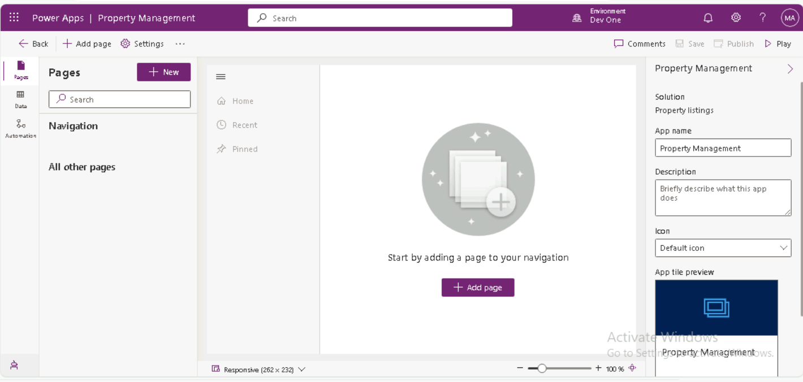
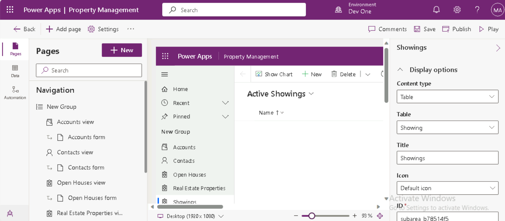

---
lab:
  title: "Lab\_3: Erstellen einer modellgesteuerten App"
  module: 'Module 2: Get started with model-driven apps in Power Apps'
---

# Übungslab 3: Erstellen einer modellgesteuerten App

## Szenario

In dieser Übung erstellen Sie eine modellgesteuerte App und fügen der App Tabellen hinzu.

Contoso Real Estate verfolgt zwei Schlüsselziele:

- Immobilienanzeigen
- Wer ist für die Besichtigung von Immobilien eingeplant?

## Lernziele

- So erstellen Sie eine modellgesteuerte App
- So fügen Sie der App Tabellen hinzu

## Weiterführende Schritte des Lab

- Eine modellgesteuerte App erstellen
- Hinzufügen von Tabellen zur App
  
## Voraussetzungen

- Sie müssen **Lab 2: Datenmodell** abgeschlossen haben

## Ausführliche Schritte

## Übung 1: Erstellen der modellgesteuerten App

In dieser Übung erstellen Sie eine modellgesteuerte App.

### Aufgabe 1.1: Erstellen einer App für die Eigenschaftenverwaltung

1. Navigieren Sie zum Power Apps Maker-Portal `https://make.powerapps.com`.

1. Stellen Sie sicher, dass Sie sich in der Umgebung **Dev One** befinden.

1. Wählen Sie **Lösungen** aus.

1. Öffnen Sie die Projektmappe **Property listings** (Immobilienanzeigen).

1. Wählen Sie **+ Neu** und dann **App** und anschließend **Modellgesteuerte App** aus.

    

1. Geben Sie unter **Name** den Namen `Property Management` ein.

1. Klicken Sie auf **Erstellen**.

    

### Aufgabe 1.2: Hinzufügen von Tabellen

1. Wählen Sie **+ Seite hinzufügen** aus.

    

1. Wählen Sie **Dataverse-Tabelle** aus.

1. Geben Sie `cre` in das **Suchfeld** ein.

    

1. Wählen Sie **Open House** (Offenes Haus), **Real Estate Property** (Immobilienbesitz) und **Showing** (Besichtigung) aus.

1. Geben Sie `account` in das **Suchfeld** ein, und wählen Sie **Konto** aus.

1. Geben Sie `contact` in das **Suchfeld** ein, und wählen Sie **Kontakt** aus.

1. Wählen Sie **Hinzufügen** aus.

    

1. Wählen Sie **Speichern**.

1. Wählen Sie **Veröffentlichen** aus.

    

### Aufgabe 1.3: Testen

1. Wählen Sie im geöffneten App-Designer zur **Eigenschaftenverwaltung** die Schaltfläche **Wiedergabe** aus.

1. Navigieren zu **Kontakte**.

1. Wählen Sie **+ Neu** aus.

1. Geben Sie `Jon` für **Vorname** ein.

1. Geben Sie `Doe` für **Nachname** ein.

1. Wählen Sie **Speichern und schließen** aus.

1. Navigieren Sie zu **Real Estate Property**.

1. Wählen Sie **+ Neu** aus.

1. Geben Sie `Test Property` für **Property Name** (Name der Immobilie) ein.

1. Wählen Sie **Speichern**.

1. Wählen Sie **Related** (Verwandte) und **Showing** (Besichtigung) aus.

    

1. Wählen Sie **+ New Showing** (Neue Besichtigung) aus.

1. Geben Sie unter **Name** den Namen `First Showing` ein.

1. Wählen Sie **Speichern und schließen** aus.

1. Wählen Sie **Speichern und schließen** aus.

