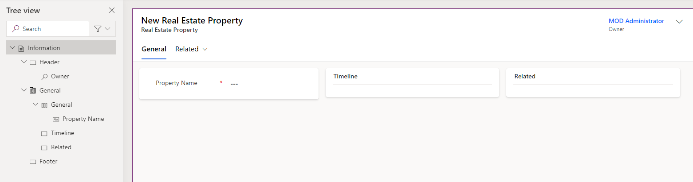

---
lab:
  title: "Lab\_4: Konfigurieren von Formularen und Ansichten"
  module: 'Module 3: Configure forms, charts, and dashboards in model-driven apps'
---

# Übungslab 4: Konfigurieren von Formularen und Ansichten

## Szenario

In diesem Lab konfigurieren Sie Formulare und Ansichten für eine modellgesteuerte App.

Contoso Real Estate verfolgt zwei Schlüsselziele:

- Immobilienanzeigen
- Wer ist für die Besichtigung von Immobilien eingeplant?

## Lernziele

- Konfigurieren von Tabellenformularen
- Konfigurieren von Tabellenansichten

## Weiterführende Schritte des Lab

- Konfigurieren von Immobilien und Anzeigen des Hauptformulars
- Konfigurieren von Registerkarten und Abschnitten
- Hinzufügen von Spalten zu Formularen
- Hinzufügen eines Unterrasters
- Erstellen eines neuen Formulars
- Zuordnen von Sicherheitsrollen zu Formularen
- Konfigurieren von Immobilien und Anzeigen von Ansichten
- Filteransichten
- Konfigurieren der Ansicht für die Schnellsuche
  
## Voraussetzungen

- Sie müssen **Lab 2: Datenmodell** abgeschlossen haben

## Ausführliche Schritte

## Übung 1: Hauptformular für Immobilien

In dieser Übung ändern Sie das Hauptformular für die Tabelle „Real Estate Property“ (Immobilien).

### Aufgabe 1.1: Layout und Spalten des Hauptformulars

1. Navigieren Sie zum Power Apps Maker-Portal `https://make.powerapps.com`.

1. Stellen Sie sicher, dass Sie sich in der Umgebung **Dev One** befinden.

1. Wählen Sie **Lösungen** aus.

1. Öffnen Sie die Lösung **Immobilienanzeigen**.

1. Wählen Sie die Tabelle **Real Estate Property** (Immobilie) aus.

1. Wählen Sie unter **Datenerfahrungen** **Formulare** aus.

1. Wählen Sie das Formular **Information** mit dem **Formulartyp** **Main** (Hauptformular), anschließend das Menü **Befehle** (...) und dann **Bearbeiten** > **Auf neuer Registerkarte bearbeiten** aus.

1. Wählen Sie die **Strukturansicht** auf der linken Seite des Formular-Designers aus.

1. Wählen Sie die Registerkarte **Allgemein** aus.

1. Geben Sie unter **Name** den Namen `generalTab` ein.

1. Wählen Sie im Bereich **Eigenschaften** auf der rechten Seite in der Dropdownliste **Layout** die Option **3 Spalten** aus.

    

1. Erweitern Sie in der **Strukturansicht** die Registerkarte **Allgemein**. Wählen Sie den ersten Abschnitt aus, und geben Sie unter **Name** `generalSection` ein.

1. Wählen Sie den zweiten Abschnitt aus, und geben Sie als **Bezeichnung** `Timeline` und als **Name** `timelineSection` ein.

1. Wählen Sie den dritten Abschnitt aus, und geben Sie als **Bezeichnung** `Related` und als **Name** `relatedSection` ein.

1. Ziehen Sie das Feld **Besitzer** in den Bereich **Kopfzeile**.

    

1. Wählen Sie den ersten Abschnitt aus.

1. Wählen Sie im linken Navigationsbereich im Formular-Designer **Tabellenspalten** aus.

1. Ziehen Sie die Spalte **Client** unter das Feld **Eigenschaftenname**.

1. Wählen Sie die Spalte **Street** (Straße) aus, um sie im Formular unterhalb des **Clients** hinzuzufügen.

1. Wählen Sie die Spalte **City** (Stadt) aus, um sie im Formular unter **Street** (Straße) hinzuzufügen.

1. Wählen Sie im linken Navigationsbereich im Formular-Designer **Komponenten** aus.

1. Wählen Sie das Steuerelement **Abschnitt mit 1 Spalte** aus, um es im Formular hinzuzufügen.

1. Geben Sie als **Bezeichnung** `Details`und als**Name** `detailsSection` ein.

1. Wählen Sie im linken Navigationsbereich im Formular-Designer **Tabellenspalten** aus.

1. Wählen Sie die Spalte **Asking Price** (Angebotspreis) aus, um sie im Abschnitt „Details“ hinzuzufügen.

1. Wählen Sie die Spalte **Currency** (Währung) aus, um sie im Formular unter **Asking Price** (Angebotspreis) hinzuzufügen.

1. Wählen Sie die Spalte **Bedrooms** (Schlafzimmer) aus, um sie im Formular unter **Currency** (Währung) hinzuzufügen.

1. Wählen Sie die Spalte **Bathrooms** (Bäder) aus, um sie im Formular unter **Bedrooms** (Schlafzimmer) hinzuzufügen.

    

### Aufgabe 1.2: Hinzufügen eines Zeitachsen-Steuerelements

1. Wählen Sie im linken Navigationsbereich des Formular-Designers die **Strukturansicht** aus.

1. Wählen Sie den Abschnitt **Zeitachse** aus.

1. Wählen Sie im linken Navigationsbereich im Formular-Designer **Komponenten** aus.

1. Erweitern Sie die **Anzeige**.

1. Wählen Sie das **Zeitachsen**-Steuerelement aus, um es im Abschnitt **Zeitachse** hinzuzufügen.

1. Wählen Sie im Formular-Designer die **Strukturansicht** aus, erweitern Sie die Registerkarte **Allgemein**, und wählen Sie den Abschnitt **Zeitachse** aus.

1. Aktivieren Sie im Bereich **Eigenschaften** auf der rechten Seite das Kontrollkästchen **Bezeichnung ausblenden**.

    

1. Wählen Sie in der **Strukturansicht** das **Hinweistext**-Steuerelement für die Zeitachse aus.

1. Wählen Sie im Bereich **Eigenschaften** auf der rechten Seite **Social Media-Aktivitäten** aus, deaktivieren Sie das Kontrollkästchen **Aktivieren**, und wählen Sie **Fertig** aus.

1. Wählen Sie im Bereich **Eigenschaften** auf der rechten Seite in der Dropdownliste **Aktivitäten sortieren nach** die Option **Erstellungsdatum** aus.

1. Wählen Sie im linken Navigationsbereich im Formular-Designer **Tabellenspalten** aus.

1. Ziehen Sie die Spalte **Statusgrund** in den Bereich **Kopfzeile**.

### Aufgabe 1.3: Hinzufügen eines Schnellansicht-Steuerelements

1. Wählen Sie die **Strukturansicht** auf der linken Seite des Formular-Designers aus.

1. Wählen Sie den Abschnitt **Zugehörig** aus.

1. Wählen Sie im linken Navigationsbereich im Formular-Designer **Komponenten** aus.

1. Erweitern Sie die **Anzeige**.

1. Wählen Sie das **Schnellansicht**-Steuerelement aus, um es im Abschnitt **Zugehörig** hinzuzufügen.

1. Wählen Sie für **Lookup** die Option **Client** und für **account contact card** (Kontokontakt) die Option **Contact** (Kontakt) und dann **Fertig** aus.

### Aufgabe 1.4: Hinzufügen einer Registerkarte

1. Wählen Sie im linken Navigationsbereich im Formular-Designer **Komponenten** aus.

1. Wählen Sie das Steuerelement **Registerkarte mit 1 Spalte** aus, um es im Formular hinzuzufügen.

1. Geben Sie als **Bezeichnung** `Showings`und als**Name** `showingTab` ein.

1. Wählen Sie im Formular-Designer auf der linken Seite die **Strukturansicht** aus, erweitern Sie die Registerkarte **Showings** (Anzeigen), und wählen Sie den Abschnitt **Neuer Abschnitt** aus.

1. Geben Sie als **Bezeichnung** `Showings`und als**Name** `showingSection` ein.

1. Wählen Sie im linken Navigationsbereich im Formular-Designer **Komponenten** aus.

1. Erweitern Sie **Raster**.

1. Wählen Sie das **Unterraster**-Steuerelement aus, um es im Abschnitt **Showings** (Anzeigen) hinzuzufügen.

1. Wählen Sie **Verknüpfte Datensätze anzeigen** aus.

1. Wählen Sie für **Tabelle** die Option **Showings (Immobilien)** (Anzeigen) und als **Standardansicht** die Option **Active Showings** (Aktive Anzeigen) und klicken sie danach auf **Fertig**.

1. Geben Sie als **Bezeichnung** `Showings`und als**Name** `showingsSG` ein.

1. Wählen Sie **Bezeichnung ausblenden** aus.

1. Wählen Sie **Speichern und veröffentlichen** aus.

1. **Schließen** Sie den Formular-Designer.

1. Wählen Sie **Fertig** aus.

## Übung 2: Anzeigen des Hauptformulars

In dieser Übung ändern Sie das Hauptformular für die Tabelle „Showings“ (Anzeigen).

### Aufgabe 2.1: Layout und Spalten des Hauptformulars

1. Navigieren Sie zum Power Apps Maker-Portal `https://make.powerapps.com`.

1. Stellen Sie sicher, dass Sie sich in der Umgebung **Dev One** befinden.

1. Wählen Sie **Lösungen** aus.

1. Öffnen Sie die Lösung **Property listings** (Immobilienanzeigen).

1. Wählen Sie die Tabelle **Showings** (Anzeigen) aus.

1. Wählen Sie unter **Datenerfahrungen** **Formulare** aus.

1. Wählen Sie das Formular **Information** mit dem **Formulartyp** **Main** (Hauptformular), anschließend das Menü **Befehle** (...) und dann **Bearbeiten** > **Auf neuer Registerkarte bearbeiten** aus.

1. Ziehen Sie das Feld **Besitzer** in den Bereich **Kopfzeile**.

1. Wählen Sie im linken Navigationsbereich im Formular-Designer **Tabellenspalten** aus.

1. Ziehen Sie die Spalte **Real Estate Property**(Immobilien) unter das Feld **Name**.

1. Wählen Sie die Spalte **Shown to** (Anzeige für) aus, um sie im Formular unterhalb von **Real Estate Property** (Immobilien) hinzuzufügen.

1. Wählen Sie die Spalte **Shown by** (Anzeige von) aus, um sie im Formular unter **Shown to** (Anzeige für) hinzuzufügen.

1. Wählen Sie die Spalte **Showing Date** (Anzeigedatum) aus, um sie Formular unter **Shown by** (Anzeige von) hinzuzufügen.

1. Wählen Sie die Spalte **Level of Interest** (Interessenebene) aus, um sie im Formular unter **Showing Date** (Anzeigedatum) hinzuzufügen.

1. Wählen Sie die Spalte **Comments** (Kommentare) aus, um sie im Formular unter **Level of Interest** (Interessenebene) hinzuzufügen.

1. Vergrößern Sie im Bereich **Eigenschaften** auf der rechten Seite die **Formularfeldhöhe** auf**3 Zeilen**.

1. Wählen Sie **Speichern und veröffentlichen** aus.

1. **Schließen** Sie den Formular-Designer.

1. Wählen Sie **Fertig** aus.

## Übung 3: Mehrere Formulare

In dieser Übung erstellen Sie ein neues Formular und beschränken den Zugriff mit einer Sicherheitsrolle.

### Aufgabe 3.1: Sicherheitsrolle

1. Navigieren Sie zum Power Apps Maker-Portal `https://make.powerapps.com`.

1. Stellen Sie sicher, dass Sie sich in der Umgebung **Dev One** befinden.

1. Wählen Sie **Lösungen** aus.

1. Öffnen Sie die Lösung **Property listings** (Immobilienanzeigen).

1. Wählen Sie **+ Neu**, anschließend **Sicherheit** und dann **Sicherheitsrolle** aus.

1. Geben Sie als **Rollennamen** `Property admin` ein.

1. Wählen Sie **Unternehmenseinheit** aus und speichern Sie die Auswahl.

1. Blättern Sie nach unten zum Abschnitt **Benutzerdefinierte Tabellen**.

1. Wählen Sie die Tabelle **Real Estate Property** aus. Ändern Sie die Zugriffsebene für alle Berechtigungen auf **Organisation**.

    

1. Wählen Sie die Tabelle **Showing** aus. Ändern Sie die Zugriffsebene für alle Berechtigungen auf **Organisation**.

1. Klicken Sie auf **Speichern und schließen**.

1. Klicken Sie auf **Fertig**.

### Aufgabe 3.2: Kopieren des Formulars

1. Wählen Sie die Tabelle **Showings** (Anzeigen) aus.

1. Wählen Sie unter **Datenerfahrungen** **Formulare** aus.

1. Wählen Sie das Formular **Information** mit dem **Formulartyp** **Main** (Hauptformular), anschließend das Menü **Befehle** (...) und dann **Bearbeiten** > **Auf neuer Registerkarte bearbeiten** aus.

1. Wählen Sie **Level of Interest** (Interessenebene) und im Bereich „Eigenschaften“ die Option **Schreibgeschützt** aus.

1. Wählen Sie **Comments** (Kommentare) und im Bereich „Eigenschaften“ die Option **Schreibgeschützt** aus.

1. Wählen Sie **Kopie speichern** aus.

1. Geben Sie als **Anzeigenamen** `Showing admin form` ein, und wählen Sie **Speichern** aus.

    

1. Wählen Sie **Formulareinstellungen** aus.

1. Wählen Sie die Sicherheitsrolle **Property admin** (Immobilienadministrator) aus.

    

1. Wählen Sie **Speichern und veröffentlichen** aus.

1. **Schließen** Sie den Formular-Designer.

1. Wählen Sie **Fertig** aus.

## Übung 4: Immobilienansichten

In dieser Übung ändern Sie die Ansichten für die Tabelle „Real Estate Property“ (Immobilien).

### Aufgabe 4.1: Öffentliche Immobilienansicht

1. Navigieren Sie zum Power Apps Maker-Portal `https://make.powerapps.com`.

1. Stellen Sie sicher, dass Sie sich in der Umgebung **Dev One** befinden.

1. Wählen Sie **Lösungen** aus.

1. Öffnen Sie die Lösung **Immobilienanzeigen**.

1. Wählen Sie die Tabelle **Real Estate Property** (Immobilie) aus.

1. Wählen Sie unter **Datenerfahrungen** **Ansichten** aus.

1. Wählen Sie die Ansicht **Active Real Estate Properties** (Aktive Immobilienanzeigen), anschließend das Menü **Befehle** (...) und dann **Bearbeiten** > **Auf neuer Registerkarte bearbeiten** aus.

1. Wählen Sie das Caretzeichen neben der Spalte **Created on** (Erstellungsdatum) und dann **Entfernen** aus.

1. Wählen Sie die Spalte **Asking Price** (Angebotspreis) aus, um sie der Ansicht hinzuzufügen.

1. Wählen Sie die Spalte **City** (Stadt) aus, um sie der Ansicht hinzuzufügen.

1. Wählen Sie die Spalte **Bedrooms** (Schlafzimmer) aus, um sie der Ansicht hinzuzufügen.

1. Wählen Sie die Spalte **Bathrooms** (Bäder) aus, um sie der Ansicht hinzuzufügen.

1. Wählen Sie die Spalte **Client** aus, um sie der Ansicht hinzuzufügen.

1. Entfernen Sie im Bereich „Eigenschaften“ den **Eigenschaftennamen** unter **Sortieren nach**.

1. Wählen Sie im Bereich „Eigenschaften“ **Sortieren nach** und dann **Asking Price** (Angebotspreis) aus.

    

1. Wählen Sie **Speichern und veröffentlichen** aus.

1. **Schließen** Sie den Ansichts-Designer.

1. Wählen Sie **Fertig** aus.

### Aufgabe 4.2: Ansicht für die Schnellsuche nach Immobilien

1. Wählen Sie die Ansicht **Quick Find Aktive Real Estate Properties** (Schnellsuche nach aktive Immobilienanzeigen), anschließend das Menü **Befehle** (...) und dann **Bearbeiten** > **Auf neuer Registerkarte bearbeiten** aus.

1. Wählen Sie das Caretzeichen neben der Spalte **Created on** (Erstellungsdatum) und dann **Entfernen** aus.

1. Wählen Sie im Bereich **Quick Find Active Real Estate Properties** (Schnellsuche nach aktiven Immobilienanzeigen) auf der rechten Seite unter **Suchen nach** die Option **Tabellenspalten für die Suche bearbeiten** aus.

1. Wählen Sie die folgenden Spalten und dann **Übernehmen** aus.

    - Ort
    - Client
    - Eigenschaftenname

1. Wählen Sie **Speichern und veröffentlichen** aus.

1. **Schließen** Sie den Ansichts-Designer.

1. Wählen Sie **Fertig** aus.

## Übung 5: Anzeigen von Ansichten

In dieser Übung ändern Sie die Ansichten für die Tabelle „Showings“ (Anzeigen).

### Aufgabe 5.1: Öffentliche Anzeigenansicht

1. Navigieren Sie zum Power Apps Maker-Portal `https://make.powerapps.com`.

1. Stellen Sie sicher, dass Sie sich in der Umgebung **Dev One** befinden.

1. Wählen Sie **Lösungen** aus.

1. Öffnen Sie die Lösung **Property listings** (Immobilienanzeigen).

1. Wählen Sie die Tabelle **Showings** (Anzeigen) aus.

1. Wählen Sie unter **Datenerfahrungen** **Ansichten** aus.

1. Wählen Sie die Ansicht **Active Showings** (Aktive Anzeigen), anschließend das Menü **Befehle** (...) und dann **Bearbeiten** > **Auf neuer Registerkarte bearbeiten** aus.

1. Wählen Sie das Caretzeichen neben der Spalte **Created on** (Erstellungsdatum) und dann **Entfernen** aus.

1. Wählen Sie die Spalte **Real Estate Property** (Immobilien) aus, um sie der Ansicht hinzuzufügen.

1. Wählen Sie die Spalte **Showing Date** (Anzeigedatum) aus, um sie der Ansicht hinzuzufügen.

1. Wählen Sie die **Shown to** (Anzeige für) aus, um sie der Ansicht hinzuzufügen.

1. Wählen Sie die Spalte **Level of Interest** (Interessenebene) aus, um sie der Ansicht hinzuzufügen.

1. Wählen Sie die Registerkarte **Zugehörig** aus.

1. Erweitern Sie **Real Estate Property** (Immobilien).

1. Wählen Sie die Spalte **Asking Price** (Angebotspreis) aus, um sie der Ansicht hinzuzufügen.

1. Entfernen Sie im Bereich „Eigenschaften“ den Eintrag **Name** unter **Sortieren nach**.

1. Wählen Sie im Bereich „Eigenschaften“ **Sortieren nach** und dann **Showing Date** (Angebotsdatum) aus.

1. Wählen Sie im Dropdownmenü **Speichern und veröffentlichen** die Option **Nur speichern** aus.

### Aufgabe 5.2: Neue Anzeigeansicht

1. Wählen Sie **Speichern unter** aus.

1. Geben Sie unter **Name** den Namen `High Interest showings` ein.

1. Wählen Sie **Speichern**.

1. Wählen Sie das Caretzeichen neben der Spalte **Level of Interest** (Interessenebene) und dann **Filtern nach** aus.

1. Wählen Sie **Gleich** und dann **Very High** (Sehr hoch) und **High** (Hoch) aus.

1. Wählen Sie **Übernehmen**.

1. Wählen Sie **Speichern und veröffentlichen** aus.

1. **Schließen** Sie den Ansichts-Designer.

1. Wählen Sie **Fertig** aus.
