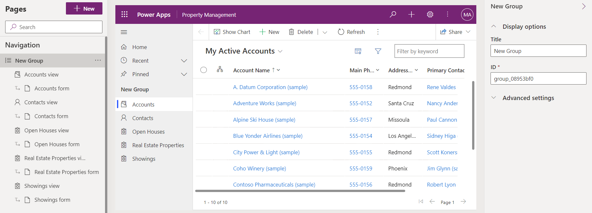

---
lab:
  title: "Lab\_5: Konfigurieren einer modellgesteuerten App"
  module: 'Module 3: Configure forms, charts, and dashboards in model-driven apps'
---

# Übungslab 5 – Konfigurieren einer modellgesteuerten App

## Szenario

In diesem Lab konfigurieren Sie eine modellgesteuerte App.

## Lernziele

- Konfigurieren der Navigation für eine modellgesteuerte App
- Einschränken von Ansichten in einer modellgesteuerten App

## Weiterführende Schritte des Lab

- Hinzufügen von Gruppen zur Navigation
- Verschieben von Tabellen in der Navigation
- Einschränken von Ansichten in der App
  
## Voraussetzungen

- Sie müssen **Lab 2: Datenmodell**, **Lab 3: Erstellen einer modellgesteuerten App** und **Lab 4: Konfigurieren von Formularen und Ansichten** absolviert haben

## Ausführliche Schritte

## Übung 1 – Konfigurieren einer modellgesteuerten App

In dieser Übung konfigurieren Sie die Navigation und Tabellen für eine modellgesteuerte App.

### Aufgabe 1.1 – Konfigurieren von Gruppen

1. Navigieren Sie zum Power Apps Maker-Portal <https://make.powerapps.com>.

1. Stellen Sie sicher, dass Sie sich in der Umgebung **Dev One** befinden.

1. Wählen Sie **Lösungen** aus.

1. Öffnen Sie die Lösung **Immobilienanzeigen**.

1. Wählen Sie im Bereich **Objekte** auf der linken Seite **Apps** aus.

1. Wählen Sie die App **Eigenschaftenverwaltung**, das Menü **Befehle** (…) und dann **Bearbeiten** > **Auf neuer Registerkarte bearbeiten** aus.

1. Wählen Sie **Neue Gruppe** im Bereich **Navigation** aus.

    

1. Geben Sie im Eigenschaftenbereich `Clients` als **Titel** ein.

1. Wählen Sie **Navigation** aus, wählen Sie das Menü **Befehle** (...) und dann **Neue Gruppe** aus.

1. Geben Sie im Eigenschaftenbereich `Properties` als **Titel** ein.

1. Wählen Sie im **Navigationsbereich** die **Ansicht „Anzeigen“**, das Menü **Befehle** (…) und dann **Nach unten** aus.

1. Wählen Sie im **Navigationsbereich** die **Ansicht „Immobilien“**, das Menü **Befehle** (…) und dann **Nach unten** aus.

1. Wählen Sie im **Navigationsbereich** die **Ansicht „Offene Besichtigungen“**, das Menü **Befehle** (…) und dann dreimal **Nach unten** aus.

    

### Aufgabe 1.2 – Einschränken von Ansichten

1. Wählen Sie im Bereich **Navigation** die **Ansicht „Anzeigen“** aus.

1. Wählen Sie im Bereich **Anzeigen** die Registerkarte **Ansichten** aus.

1. Wählen Sie die **Ansicht „Inaktive Anzeigen“** im rechten Bereich, das Menü **Befehle** (…) und dann **Entfernen** aus.

    

1. Wählen Sie **Speichern**.

1. Wählen Sie **Veröffentlichen** aus.

1. **Schließen** Sie den App-Designer und wählen Sie **Fertig** aus.

