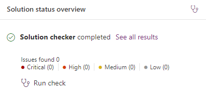
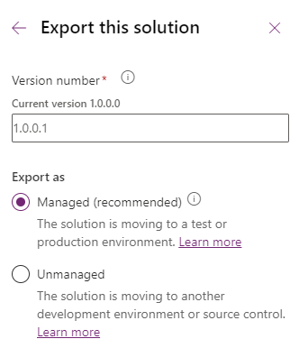

---
lab:
  title: "Lab\_6: Projektmappe exportieren"
  module: 'Module 4: Manage solutions in Power Apps and Power Automate'
---

# Übungs-Lab 6 – Lösung exportieren

## Szenario

In diese, Lab exportieren Sie die Lösung

## Lernziele

- Exportieren einer Microsoft Dataverse-Lösung

## Weiterführende Schritte des Lab

- Veröffentlichen von Anpassungen
- Lösungsprüfung ausführen
- Lösung exportieren
  
## Voraussetzungen

- Sie müssen **Lab 5: Konfigurieren modellgesteuerter App** abgeschlossen haben.

## Ausführliche Schritte

## Übung 1 – Lösung exportieren

In dieser Übung exportieren Sie die Lösung aus der Entwicklungsumgebung.

### Aufgabe 1.1 – Änderungen veröffentlichen

1. Navigieren Sie zum Power Apps Maker-Portal `https://make.powerapps.com`

1. Stellen Sie sicher, dass Sie sich in der Umgebung **Dev One** befinden.

1. Wählen Sie **Lösungen** aus.

1. Wählen Sie die Lösung für **Eigenschaftenauflistungen** aus.

1. Wählen Sie in der Lösung die Registerkarte **Übersicht** aus.

    

1. Wählen Sie **Alle Anpassungen veröffentlichen** aus.

### Aufgabe 1.2 – Lösungsprüfung

1. Wählen Sie in der Lösung die Registerkarte **Übersicht** aus.

1. Wählen Sie **Überprüfung ausführen** unter **Übersicht über den Lösungsstatus** aus.

1. Warten Sie einige Minuten, bis die Lösungsprüfung abgeschlossen ist.

    

1. Es sollten keine Warnungen oder Fehler angezeigt werden.

### Aufgabe 1.3 – Verwaltete Lösung exportieren

1. Wählen Sie **Exportieren**.

1. Wählen Sie **Weiter** aus.

1. Die Versionsnummer sollte auf **1.0.0.1** erhöht worden sein.

    

1. Wählen Sie für **Exportieren als** **Verwaltet** aus.

1. Wählen Sie **Exportieren**.

1. Der Export wird im Hintergrund vorbereitet. Wenn die Lösung fertig ist, wählen Sie die Schaltfläche **Herunterladen** aus.

### Aufgabe 1.4 – Nicht verwaltete Lösung exportieren

1. Wählen Sie **Exportieren**.

1. Wählen Sie **Weiter** aus.

1. Die Versionsnummer sollte auf **1.0.0.2** erhöht worden sein.

1. Ändern der Versionsnummer in `1.0.0.1`

1. Wählen Sie für **Exportieren als** **Nicht verwaltet** aus.

1. Wählen Sie **Exportieren**.

1. Der Export wird im Hintergrund vorbereitet. Wenn die Lösung fertig ist, wählen Sie die Schaltfläche **Herunterladen** aus.

